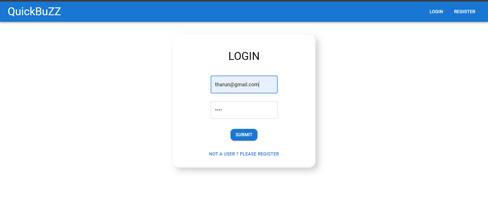

# QuickBuzz Blog Project

## Overview

The **QuickBuzz** blog project is a web application designed for publishing and managing blogs. It allows users to create accounts, write blogs with titles, descriptions, and optional images, and interact with other users' blogs.

## Features

- **User Authentication**: Users can sign up, log in, and log out securely.
- **Blog Management**: Users can create, read, update, and delete their own blogs.
- **User Interaction**: Users can view and interact with other users' blogs.
- **Image Handling**: Supports optional image uploads for blog posts, with a default image URL provided if none is specified.
- **Database Integration**: Uses MongoDB for storing user and blog data.
- **RESTful API**: Backend provides a RESTful API for frontend interactions.

## Technologies Used

- **Frontend**: HTML, CSS, JavaScript,React
- **Backend**: Node.js, Express.js
- **Database**: MongoDB with Mongoose
- **Other Tools**: Git for version control, Postman for API testing
- 
## Screenshots

### Home Page

### Login Page

